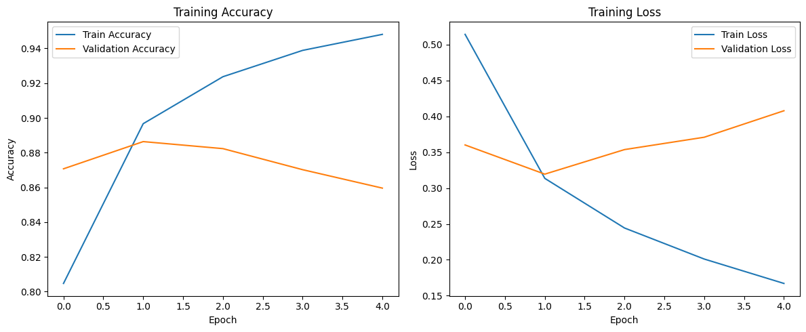
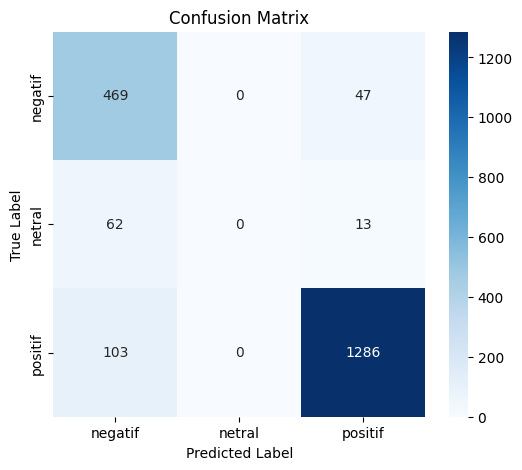

# Sentiment Analysis on Gojek Reviews


A Deep Learning project for sentiment classification of Gojek user reviews using TensorFlow and Bidirectional LSTM.



---

## Overview

This project performs sentiment analysis on Gojek application reviews collected from Google Play Store.

The workflow includes:

- Data scraping
- Text preprocessing
- Label encoding
- Deep Learning model training
- Model evaluation
- Confusion Matrix visualization

---

## Dataset

Source:

Google Play Store Reviews (Gojek)

Sentiment Classes

- Positive
- Neutral
- Negative

---

## Features

- Google Play review scraping
- Indonesian text preprocessing
- LSTM & BiLSTM comparison
- EarlyStopping
- Confusion Matrix
- Classification Report
- Accuracy evaluation

---

## Project Structure

```text
sentiment-analysis-gojek/
├── assets/
│   ├── training-history.png
│   └── confusion-matrix.png
├── dataset_gojek.csv
├── scraping.ipynb
├── sentiment_analysis.ipynb
├── requirements.txt
└── README.md
```

---

## Model Performance

| Metric | Value |
|--------|-------:|
| Test Accuracy | **88.69%** |

### Training History


---

## Confusion Matrix



---

## Model Architecture

- Embedding Layer
- Bidirectional LSTM
- Dropout
- Dense Layer
- Softmax Output

---

## Technologies

- Python
- TensorFlow
- Keras
- Scikit-learn
- Pandas
- NumPy
- Matplotlib

---

## Future Improvements

- Increase dataset size
- Better class balancing
- Transformer-based models (IndoBERT)
- Hyperparameter tuning
- Deploy using Streamlit

---

## Author

**Miqdad Badjuber**

GitHub: https://github.com/miqdadbadjuber
